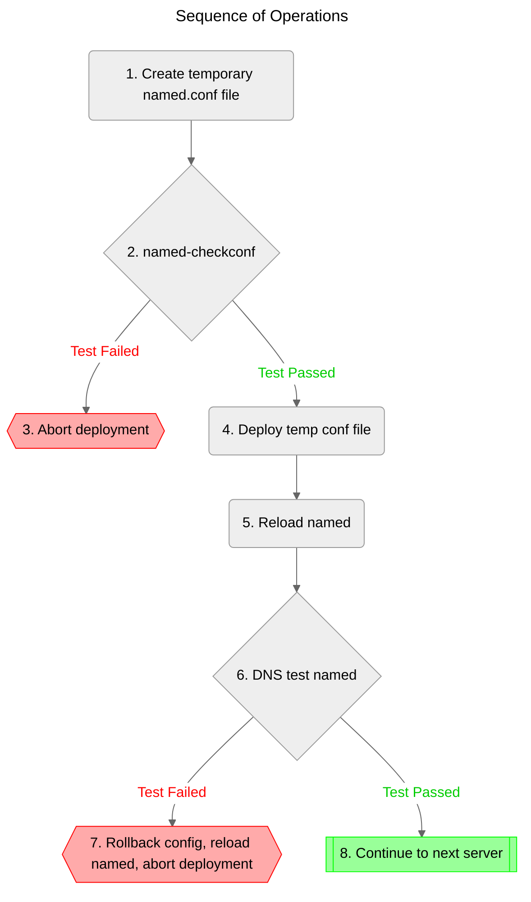

# dns-forwarder-config
This project contains templates, variables, and playbooks to manage the configuration of our DNS forwarders

## How to use
All day-to-day operations can be completed within the `vars.yml` file. This file is documented with inline comments so
it should be self-explanatory.

You will need ansible installed on your PC. To deploy changes you will need SSH and sudo access to the DNS servers.
The test playbook does not require SSH or sudo access as it executes locally.

To add / remove DNS servers, update the `hosts` file in this directory.

To reiterate, adding new forwarded zones only requires that you to make changes to `vars.yml`. You should not update any
other files in this repository unless you know what you are doing.

### test playbook
The test playbook generates a copy of the named.conf file on your local PC instead of deploying it to the DNS servers.
This is helpful for troubleshooting or validating new template changes.

To execute the playbook cd into this directory and run `ansible-playbook -i hosts -K test.yml`

### deploy playbook
The deploy playbook will deploy an updated named.conf file to each DNS server based on the template and variables in this project.

To execute the playbook cd into this directory and run `ansible-playbook -i hosts -K deploy.yml`

It follows this sequence of operations:

1. Create a temporary named.conf file on the target server
2. Test the temporary named.conf file with named-checkconf
3. If the test fails, abort the play
4. If the test succeeds:
   1. Backup current working config
   2. Copy temp config into named working directory
5. Reload named
6. Perform DNS resolution test
7. If the test fails, rollback the config changes, reload named, and abort the play
8. If the test succeeds, move on to the next server"# TestRepo" 
# TestRepo
